# How to work with me

## Workday Timeline

> If you’d like to know whether I’m on a trip, please check my current location at [**Where is Jorge Today?**](https://whereisjorge.today/)

```mermaid
gantt
    title Daily Schedule
    dateFormat HH:mm
    axisFormat %H:%M

    section Schedule
    🔴 Focus time             :active, 09:00, 1.5h
    🟡 Meetings & Slack       :meetings, 10:30, 1h
    🟢 Let's talk             :talk1, 11:30, 1h
    🔴 Flexible lunch time    :lunch, 12:00, 2h
    🟢 Let's talk             :talk2, 13:30, 1.5h
    🔴 Super Focus time       :super_focus, 15:00, 2h
    🟡 Async replies only     :async, 17:00, 2h
```

### Collaboration Tips

- **Scheduling**: Book meetings during my dedicated times (10:30-11:30 or 14:00-15:00). If something is urgent and can’t wait, use the 🟢 Let's talk blocks.
- **Lunch Break**: I’m generally offline between 12:00-14:00. Please allow some response time if you reach out during this window.
- **Async Communication**: Prefer async messaging (e.g., Slack) outside of my core hours to allow focused work blocks and a balanced schedule. During 🟢 blocks, I’ll be more responsive, but urgent messages should come with context and priority level.

## Working Style

### Preferred Workflow

My ideal day involves structured focus in the morning, with a bit more flexibility in the afternoon. I thrive with enough context and autonomy to approach challenges with my own methods while aligning with team and project goals.

### Team Interaction

- **Async Communication**: I prefer messaging that respects my focus times and encourages a healthy work rhythm.
- **Casual Conversations**: I enjoy team connections on light-hearted topics during non-focus times; it adds to a collaborative environment.

### Feedback Style

- **Giving Feedback**: I like structured, anonymous feedback loops (e.g., 360 reviews) but am also open to direct feedback if I know the team member well or they request it.
- **Receiving Feedback**: Direct, constructive, and private feedback works best for me. If something needs adjusting, feel free to reach out to me individually.

### Handling Stress

I prioritize a low-stress environment for a happy and productive life. When stress does arise, I handle it with focus and efficiency. If high stress persists over a long period, I evaluate the situation and look for adjustments to restore balance and productivity.

### Conflict Resolution

I’m a firm believer in communication. If there’s a conflict, I clarify each point of view until we’re all on the same page.

### What I Value

Challenge is a key motivator—whether it's a new language, coding style, or framework. I value room for growth and opportunities to learn while contributing to meaningful projects.

## Daily Logistics

- **Work Location**: I prefer remote work but am open to in-person meetings if needed for specific projects or team events. You can even track my current location in [Where is Jorge Today?](https://whereisjorge.today/).
- **Communication**: Slack is ideal for minor or async questions. If my response is delayed, I may be focused on a priority task. Feel free to ping me again if your request is urgent and include a priority level. Please avoid messages like "Hello" without context—I might forget to follow up without details!
- **Meetings**: Short, 30-minute Google Meet calls are best for project alignment or urgent discussions.

## How I Can Help You

I’m enthusiastic about problem-solving across topics like coding (any language), pipelines, and finance. I also love discussing code structure and architecture, so feel free to loop me into those conversations.

## How You Can Help Me

- **Clear Deadlines**: I tend to dive deep in research; longer but specific deadlines help me stay focused.
- **Dependency Timelines**: Realistic estimates (+20%) are super helpful for alignment.
- **Direct Feedback**: Constructive feedback is always welcome. An individual ping with suggestions goes a long way.

---

Let me know if there’s anything I can clarify. I look forward to working together!
